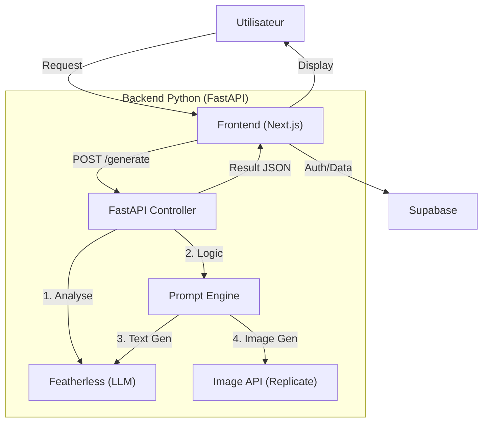

# Plan d'Implémentation : CreatorFlow AI (Spécial Hackathon 9h)

## 🎯 Objectif
Lancer un MVP d'une plateforme SaaS qui génère du contenu marketing personnalisé (Texte + Image) en analysant le style unique du créateur.

## 🛠 Stack Technique

### Frontend (L'expérience "Lovable")
-   **Framework** : Next.js 14 (App Router)
-   **Styling** : Tailwind CSS + Shadcn/UI
-   **Hébergement** : Vercel

### Backend (Le "Cerveau")
-   **API** : **Python (FastAPI)**
-   **Database** : **Supabase**
-   **Hébergement** : Render / Railway

### Intelligence Artificielle
-   **Texte** : **Featherless.ai** (Mistral/Llama)
-   **Image** : **Replicate** (Flux/SDXL) ou **OpenAI** (DALL-E 3)

## 🏗 Architecture

## 📋 Plan de Développement (9 Heures)

| Phase | Horaire (H) | Tâches Clés |
| :--- | :--- | :--- |
| **1. Fondations** | H 0 - 1.5 | • Init Repo Monorepo • Setup Supabase & Auth • Setup Shadcn/UI |
| **2. Backend Logic** | H 1.5 - 4.5 | • **Endpoint `/analyze`** : Pipeline Featherless • **Endpoint `/generate`** : Chaîne de prompts • Intégration Replicate/DALL-E |
| **3. Interface UI** | H 4.5 - 7.5 | • Dashboard "Style DNA" • Formulaire "Quick Create" • Grille de résultats |
| **4. Polish** | H 7.5 - 9.0 | • Loading states • Déploiement |
