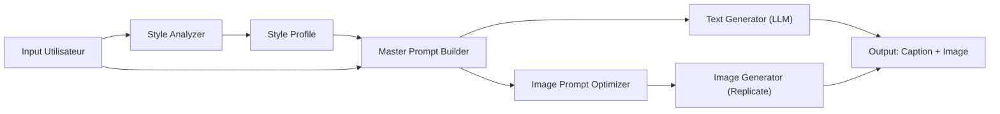

# Backend Implementation Plan: Prompt Engine

## Contexte
**Persona Cible** : Cindy, 22 ans, créatrice de contenu beauté, présente des produits.
**Objectif** : Générer du contenu (texte + image) adapté à son style personnel.

---

## 🎯 Architecture du Prompt Engine



### Pipeline en 4 étapes :
1. **Style Analyzer** : Extrait le "DNA" du créateur (ton, vibes, patterns)
2. **Context Builder** : Assemble le contexte complet (persona + produit + format)
3. **Text Generator** : Génère les captions/scripts avec le style injecté
4. **Image Prompt Optimizer** : Transforme le contexte en prompt image optimisé

---

## 📋 API Contract

### 1. `POST /api/v1/analyze-style`
Analyse le style du créateur à partir d'exemples texte et visuels.

**Request:**
```json
{
  "text_samples": [
    "Obsédée par ce nouveau gloss 💋✨ #beautyhaul",
    "POV: tu découvres LE mascara qui change tout 👀",
    "Routine du soir → résultat du matin 🌙☀️"
  ],
  "reference_image_url": "https://...style_inspo.jpg",
  "product_image_url": "https://...serum_bottle.jpg",
  "creator_info": {
    "name": "Cindy",
    "age": 22,
    "niche": "beauty",
    "content_type": "product_presentation"
  }
}
```

> [!NOTE]
> - `reference_image_url` (optionnel) : Image de référence pour analyser le style visuel (couleurs, mood, esthétique)
> - `product_image_url` (optionnel) : Photo du produit à promouvoir (sera analysée pour extraire les détails)

**Response:**
```json
{
  "style_profile": {
    "tone": "playful_girly",
    "voice": "first_person_casual",
    "emoji_usage": "high",
    "hook_pattern": "POV_or_question",
    "sentence_length": "short_punchy",
    "signature_phrases": ["obsédée", "game changer", "trust me"],
    "vibe_keywords": ["glowy", "effortless", "aesthetic", "slay"]
  },
  "visual_style": {
    "dominant_colors": ["soft pink", "warm beige", "gold accents"],
    "lighting": "golden_hour_soft",
    "composition": "minimalist_flatlay",
    "mood": "luxe_accessible"
  },
  "product_analysis": {
    "product_type": "skincare_serum",
    "key_features": ["vitamin C", "glass dropper bottle", "orange tint"],
    "suggested_angles": ["product hero", "texture shot", "before/after"]
  }
}
```

---

### 2. `POST /api/v1/generate`
Génère le contenu multi-format.

**Request:**
```json
{
  "user_request": "Post pour présenter un nouveau sérum vitamine C",
  "style_profile_id": "sp_abc123",
  "reference_image_url": "https://...",
  "formats": ["instagram_post", "tiktok_caption", "story"],
  "platforms": ["instagram", "tiktok"]
}
```

**Response:**
```json
{
  "results": [
    {
      "format": "instagram_post",
      "platform": "instagram",
      "caption": "POV: tu trouves enfin LE sérum qui fait tout ✨🍊\n\nMon nouveau crush beauté → ce sérum vitamine C qui donne un glow insane dès la 1ère application 👀\n\nTrust me sur celui-là, game changer absolu 💫\n\n#skincare #vitamineC #glowup",
      "image_prompt": "aesthetic flatlay of vitamin C serum bottle on marble surface, soft golden hour lighting, fresh orange slices, dewy skin texture, minimalist beauty photography, instagram style, 1:1 aspect ratio",
      "image_url": "https://replicate.../generated.png"
    },
    {
      "format": "tiktok_caption",
      "platform": "tiktok",
      "caption": "le sérum qui a changé ma peau en 2 semaines 🍊✨ (spoiler: obsédée)",
      "image_prompt": null,
      "image_url": null
    }
  ]
}
```

---

## 🧠 Prompt Engineering Strategy

### System Prompt Template (Text Generation)
```
Tu es un assistant de création de contenu pour créateurs beauté.

CRÉATEUR:
- Nom: {creator_name}
- Niche: {niche}
- Ton: {tone}
- Style de phrases: {sentence_style}
- Emojis: {emoji_level}
- Phrases signatures: {signature_phrases}

RÈGLES:
1. Écris EXACTEMENT comme ce créateur le ferait
2. Utilise ses patterns de hook ({hook_pattern})
3. Garde ses vibes ({vibe_keywords})
4. Format adapté à {platform}
5. Longueur max: {max_length}
```

### Image Prompt Template
```
Tu transformes une demande de contenu en prompt optimisé pour Flux/SDXL.

CONTEXTE:
- Produit: {product_description}
- Style visuel: {visual_style} (glowy, minimal, aesthetic)
- Platform: {platform} → aspect ratio {aspect_ratio}

SORTIE:
Un prompt en anglais, technique, optimisé image gen. Inclure:
- Subject principal
- Lighting (golden hour, studio, etc)
- Mood/atmosphere
- Technical specs (aspect ratio, style reference)
```

---

## 📁 Structure Backend Proposée

```
backend/
├── main.py                 # FastAPI app
├── requirements.txt
├── .env
├── core/
│   ├── __init__.py
│   ├── config.py           # Settings & env vars
│   └── llm_client.py       # Featherless wrapper
├── services/
│   ├── __init__.py
│   ├── style_analyzer.py   # Style extraction logic
│   ├── prompt_builder.py   # Master prompt assembly
│   ├── text_generator.py   # Caption/script generation
│   └── image_generator.py  # Replicate integration
├── models/
│   ├── __init__.py
│   ├── requests.py         # Pydantic input models
│   └── responses.py        # Pydantic output models
└── prompts/
    ├── style_analysis.txt  # System prompts templates
    ├── text_generation.txt
    └── image_optimization.txt
```

---

## 🚀 Prochaines Étapes

1. **Refactorer `main.py`** → Séparer en modules (services, models, prompts)
2. **Implémenter `style_analyzer.py`** avec parsing JSON robuste
3. **Créer les templates de prompts** dans `/prompts/`
4. **Ajouter endpoint `/generate`** complet avec Cindy comme test case
5. **Connecter le frontend** au backend

---

## ⚠️ Points d'Attention

> [!WARNING]
> **Rate Limits** : Featherless et Replicate ont des limites. Prévoir du caching pour les style profiles.

> [!IMPORTANT]
> **Latence** : La génération d'image prend ~10-30s. Implémenter un système async ou polling côté frontend.
